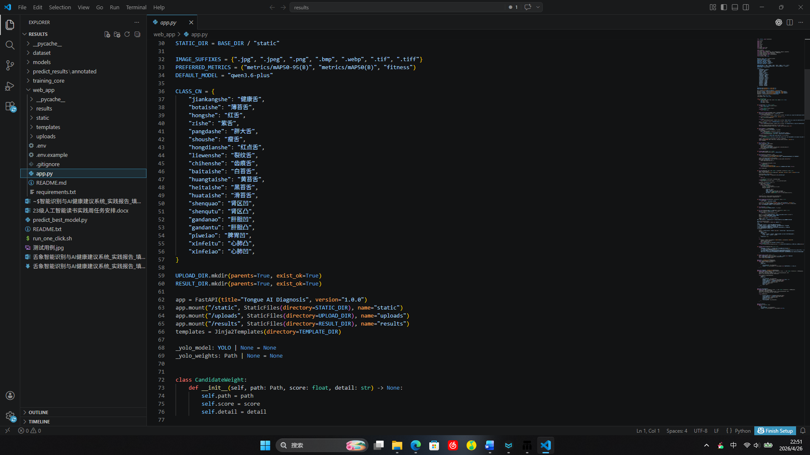
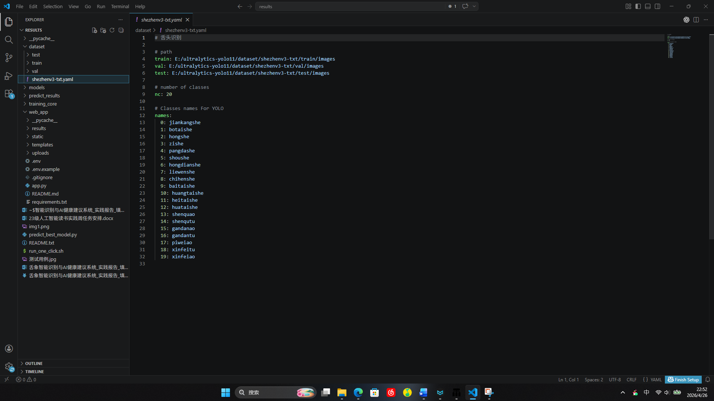
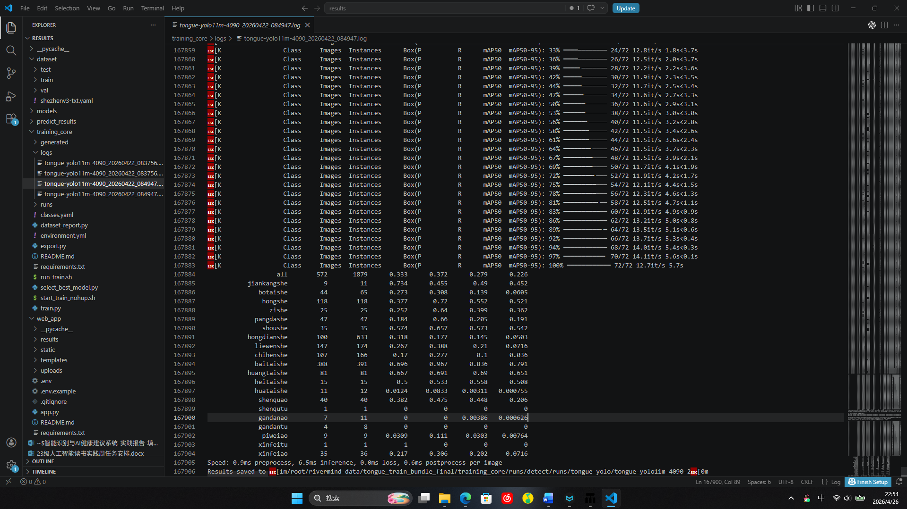
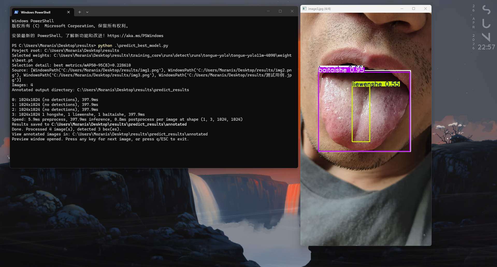
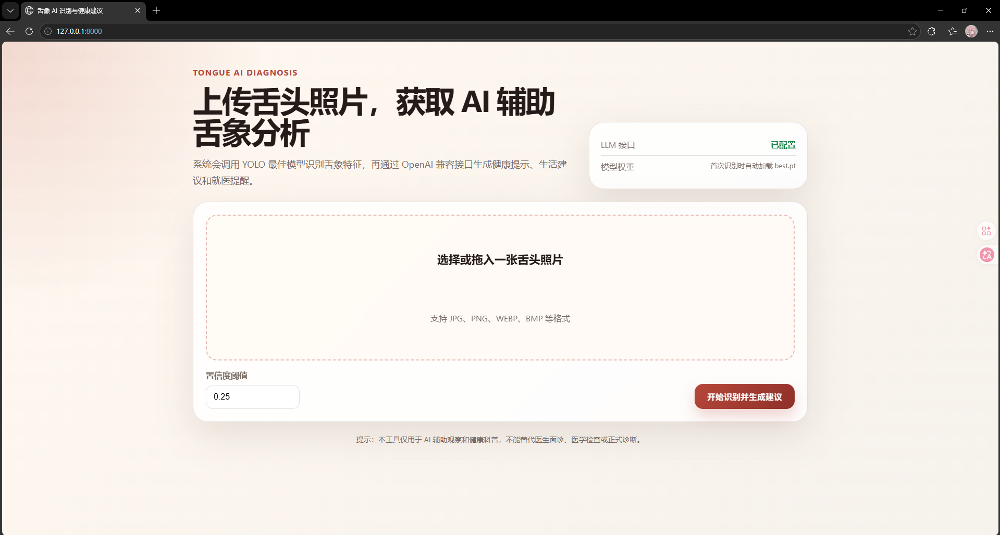
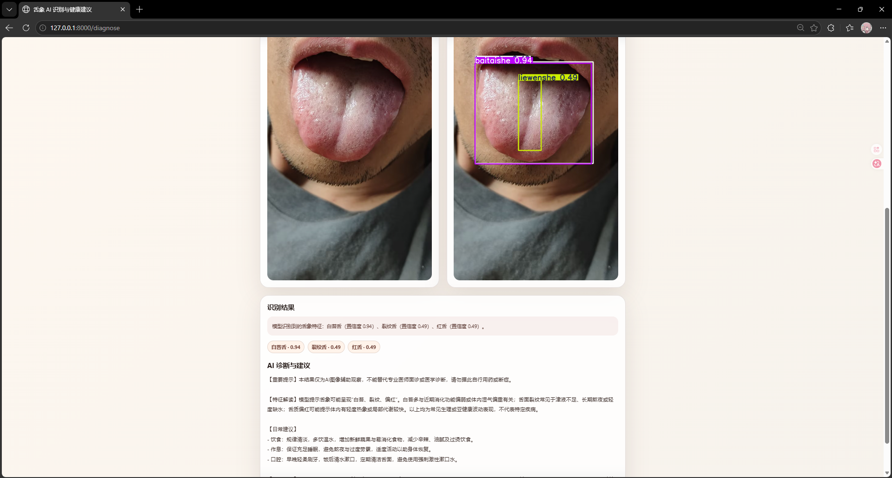

# 舌象智能识别与AI健康建议系统实践报告

首页信息：实践主题为“舌象智能识别与AI健康建议系统”；姓名、专业、班级请按实际情况补充。

## 项目简介（问题定义与价值）

本项目面向日常健康观察与中医舌象辅助分析场景。普通用户在身体状态出现轻微波动、口腔状态发生变化或希望进行健康管理时，往往只能凭主观经验观察舌头颜色、舌苔厚薄、裂纹、齿痕等特征，缺少客观、可复现、可记录的辅助工具。传统舌诊依赖专业人员经验，线下问诊成本较高，且用户难以长期保存和比较自己的舌象变化。因此，本项目尝试利用计算机视觉方法对舌头照片进行目标检测和特征识别，并结合大语言模型生成通俗、谨慎的健康提示和生活建议。

使用视觉方法解决该问题具有较强的适配性。舌象特征主要体现在图像中的颜色、纹理、形态、局部区域凸凹、舌苔覆盖等可见信息上，适合通过图像检测模型进行自动识别。已有解决方法包括人工舌诊、简单图像分类、基于传统图像处理的颜色阈值分析等，但这些方法要么依赖专业经验，要么对拍摄光照、角度、背景较敏感，泛化能力有限。本项目采用 YOLO 系列目标检测模型，能够在一张照片中同时识别多类舌象特征，并输出置信度与标注结果；同时通过 Web 页面提供交互，降低用户使用门槛。

本项目的用户价值主要体现在三个方面。第一，用户只需上传一张舌头照片，即可看到原图、模型标注图和识别到的舌象特征，过程直观。第二，系统将模型识别结果转化为自然语言说明，再调用 OpenAI 兼容接口的大语言模型生成健康提示，使输出更容易被普通用户理解。第三，系统在提示中明确说明 AI 结果不能替代医生诊断，避免将模型结果直接等同于医学结论，更适合用于健康科普、课程实践演示和后续研究扩展。

## 项目进度

## 技术路线图

本项目的技术路线可以描述为“数据准备—模型训练—模型选择—Web 服务封装—用户交互—LLM 建议生成—结果展示”的完整流程。首先，在数据准备阶段，项目采用开源舌象检测数据集，整理图像与 YOLO 格式标注文件，并确认类别名称、训练集、验证集和测试集路径。随后在模型训练阶段，使用 Python 与 Ultralytics YOLO 框架加载预训练权重 yolo11m.pt，在舌象数据集上进行迁移训练，训练过程中保存 best.pt、last.pt 以及阶段性 epoch 权重文件，并输出 results.csv 记录每轮训练的损失、Precision、Recall、mAP50、mAP50-95 等指标。

模型选择阶段并不是简单固定某一个权重文件，而是通过程序扫描项目目录下的 best.pt，并读取对应训练目录中的 results.csv，优先依据 metrics/mAP50-95(B) 指标选择表现最好的训练结果；如果缺少指标文件，则退回到文件修改时间作为兜底选择。这样做的目的是减少手动切换模型的成本，使 Web 项目启动后能够自动调用当前项目内较优的训练权重。

推理阶段的核心流程为：用户在浏览器中打开 FastAPI 提供的页面，上传一张舌头照片；后端接收 UploadFile，校验文件后缀与图片有效性，将图片保存到 uploads 目录；系统加载 YOLO 模型，对图片进行目标检测，得到类别、置信度和坐标框；后端调用 result.plot() 生成带检测框的标注图，并保存到 results 目录；同时将检测到的类别映射为中文舌象名称，例如健康舌、红舌、紫舌、胖大舌、裂纹舌、齿痕舌、白苔舌、黄苔舌以及不同脏腑区域凸凹特征等。

LLM 建议生成阶段的流程为：后端将“模型识别到的舌象特征”和每个特征的置信度整理成文字，构造提示词，强调输出必须是谨慎的健康科普信息，不能做确定性疾病诊断，也不能替代医生面诊。随后通过 requests 向 OpenAI 兼容接口 https://e-flowcode.cc/v1/chat/completions 发起请求，模型名称为 qwen3.6-plus。LLM 返回的内容会被页面展示为“AI 诊断与建议”，内容包括 AI 辅助观察说明、可能的生活调理方向、饮食作息建议、口腔卫生提醒以及必要时就医的建议。如果 API Key 未配置或接口调用失败，系统会使用本地兜底建议，保证 Web 项目仍可演示。

前端展示阶段采用 HTML、CSS 与少量 JavaScript 实现。页面包含上传区域、图片预览、置信度阈值输入、提交按钮、原始图片展示、模型标注图片展示、识别标签展示和 AI 建议展示。用户体验路线是：进入首页后选择图片，浏览器端先显示预览，提交后后端完成识别和建议生成，页面刷新并展示结果。整个技术栈为 Python 3.11、FastAPI、Uvicorn、Ultralytics YOLO、Pillow、OpenCV、Jinja2、Requests、python-dotenv、HTML、CSS 和 JavaScript。项目目前没有依赖复杂的前后端分离框架，原因是课程实践周强调可演示的最小可行性产品，单体 FastAPI 架构更便于快速集成模型推理、页面展示和 API 调用。

## 数据来源与预处理方案

本项目数据来源为开源数据集 m28805746-max/Intelligent-tongue-diagnosis-detection-dataset，该数据集发布在 GitHub，面向智能舌诊检测任务，包含舌头图像及对应的检测标注。数据集中包含多种舌象类别，项目中使用的类别包括 jiankangshe、botaishe、hongshe、zishe、pangdashe、shoushe、hongdianshe、liewenshe、chihenshe、baitaishe、huangtaishe、heitaishe、huataishe、shenquao、shenqutu、gandanao、gandantu、piweiao、xinfeitu、xinfeiao 等，共 20 类。为了便于页面展示和 LLM 理解，系统在推理阶段将这些拼音类别映射为中文标签，例如健康舌、薄苔舌、红舌、紫舌、胖大舌、瘦舌、红点舌、裂纹舌、齿痕舌、白苔舌、黄苔舌、黑苔舌、滑苔舌等。

数据预处理方案主要包括四个部分。第一，数据结构整理。将原始图像与标注按照 YOLO 训练所需目录进行组织，形成 train/images、val/images、test/images 以及对应 labels 目录，并编写数据集配置 yaml 文件，声明训练集、验证集、测试集路径、类别数量和类别名称。第二，标注格式检查。检查标签是否符合 YOLO 的 txt 格式，即每一行包含类别编号、中心点 x、中心点 y、宽度、高度，且坐标为归一化值；同时关注是否存在空标注、类别编号越界、图片与标签不匹配等问题。第三，训练输入统一。训练时通过 Ultralytics 框架设置 imgsz，项目训练脚本中主要采用 1024 尺寸输入，并由 YOLO 框架完成缩放、letterbox 等处理，减少不同图像尺寸带来的影响。第四，增强策略控制。训练过程中使用了适度的数据增强，例如 HSV 颜色扰动、轻微旋转、平移、缩放、水平翻转、mosaic 等，以增强模型对拍摄角度、光照变化和舌体位置变化的适应能力；同时避免过强增强破坏舌象颜色和纹理特征，因为舌诊任务中颜色和舌苔细节本身具有重要意义。

在 Web 推理阶段的预处理更偏向稳定和安全。用户上传图片后，系统首先判断文件扩展名是否属于 jpg、png、webp、bmp、tif 等常见图像格式，再使用 Pillow 验证图片是否可以正常打开，防止非图片文件进入推理流程。推理时统一使用 YOLO 模型的 predict 接口，并设定默认置信度阈值 0.25、IoU 阈值 0.7 和图像尺寸 1024。用户可以在页面中调整置信度阈值，以观察不同阈值下识别结果的变化。

## 已完成

### 3.1 环境搭建与项目结构整理

已完成 Python Web 项目环境搭建。项目采用 FastAPI 作为后端框架，Uvicorn 作为 ASGI 服务器，Jinja2 作为模板渲染引擎，Ultralytics YOLO 作为目标检测框架，Pillow 与 OpenCV 负责图片校验、绘制和保存，Requests 负责调用外部 LLM API，python-dotenv 负责读取本地环境变量。项目已整理出 web_app 目录，包含 app.py、templates/index.html、static/style.css、static/main.js、requirements.txt、.env.example、.gitignore 和 README.md 等文件。

### 3.2 数据集获取与类别配置

已完成开源数据集的使用方案确认，数据集来源为 GitHub 项目 m28805746-max/Intelligent-tongue-diagnosis-detection-dataset。项目中保留了 classes.yaml 和数据集 yaml 配置，类别数量为 20 类。已在 Web 后端建立拼音类别到中文类别的映射表，便于用户在页面中直接看到中文舌象特征，而不是只看到训练标签。截图描述：可补充 classes.yaml 或数据集配置文件截图，展示 20 个类别名称；也可补充数据集中若干张舌头样例图片截图，说明数据来源和任务类型。

### 3.3 YOLO 训练与最佳模型调用

已完成 YOLO 模型训练相关脚本与模型权重整理。训练入口包含 train.py，支持数据集路径、类别文件、训练轮数、图像尺寸、batch、device、workers、patience、project、name、cache、resume、optimizer、seed、amp 等参数。项目训练结果目录中包含 best.pt、last.pt 和不同 epoch 的阶段性权重，同时保存 results.csv。已实现 select_best_model.py 和 Web 后端中的自动模型选择逻辑，能够扫描 best.pt 并根据 results.csv 中的 metrics/mAP50-95(B)、metrics/mAP50(B) 或 fitness 选择最佳权重。

### 3.4 本地推理脚本与窗口展示

已完成独立推理脚本 predict_best_model.py。该脚本可以自动查找 best.pt，对项目根目录或指定测试目录中的图片进行推理，并将带检测框的标注图片保存到 predict_results/annotated。根据后续需求，脚本又增加了 OpenCV 窗口展示功能，推理完成后可以逐张预览标注结果，按任意键查看下一张，按 q 或 ESC 退出；也支持使用 --no-window 参数关闭窗口。

### 3.5 Web 上传识别功能

已完成 Web 页面与后端上传识别流程。用户进入首页后可以选择或拖入一张舌头照片，前端会立即显示上传预览；点击“开始识别并生成建议”后，FastAPI 后端保存图片、调用 YOLO 模型推理、生成标注图片，并将识别到的舌象标签和置信度传回页面。页面展示原图、模型标注图、识别结果文本和标签列表。截图描述：可补充首页上传界面截图、选择图片后的预览截图，以及识别完成后包含原图和标注图的结果页面截图。

### 3.6 LLM API 接入与健康建议生成

已完成 OpenAI 兼容 LLM API 接入。项目通过 .env 读取 OPENAI_API_KEY、OPENAI_BASE_URL 和 OPENAI_MODEL，当前接口使用 qwen3.6-plus。后端会把 YOLO 识别结果组织为提示词，要求 LLM 输出中文健康提示，明确声明不能替代医生诊断，并给出饮食、作息、口腔卫生和必要就医建议。若接口调用失败或未配置 API Key，系统会自动返回本地兜底建议，保证演示稳定性。

### 3.7 组内贡献记录

组内贡献可按实际成员情况补充。当前建议记录方式如下：成员 A 负责数据集调研、GitHub 开源数据集下载、类别文件整理和数据集 yaml 配置；成员 B 负责 YOLO 训练脚本编写、训练参数设置、模型权重管理和训练结果指标分析；成员 C 负责 FastAPI 后端开发，包括图片上传、图片校验、模型推理、标注图保存和 JSON API；成员 D 负责前端页面开发，包括上传界面、图片预览、结果展示、样式设计和用户交互；成员 E 负责 LLM 接口接入、提示词设计、健康建议安全边界控制、README 编写和实践报告整理。若小组人数较少，可将上述职责合并到对应成员名下。

## 延期中

虽然项目的最小可行性产品已经能够完成从图片上传、YOLO 识别、LLM 建议生成到页面展示的核心流程，但从课程实践和工程完善角度看，仍有若干任务处于延期中。第一，模型性能的系统评估尚未完全完成。目前项目已经保存训练结果和 best.pt，但还没有形成正式的测试集评估表格，例如每一类舌象的 Precision、Recall、F1、mAP、混淆矩阵以及典型错误样例统计。第二，拍摄规范与图像质量控制模块仍在延期中。当前系统允许用户上传任意舌头图片，但没有自动判断图片是否过暗、过曝、模糊、舌头区域过小、背景干扰过强或拍摄角度过偏，这可能影响识别稳定性。第三，LLM 建议内容的可控性仍需进一步测试。当前提示词已经要求输出健康科普信息并避免确定性诊断，但不同输入标签组合下，LLM 是否始终保持谨慎、是否会过度推断，仍需要更多案例验证。

第四，Web 页面目前侧重单张图片识别，尚未完成历史记录与对比功能。实际健康管理场景中，用户可能希望比较不同日期的舌象变化，但当前系统没有用户登录、历史保存、时间轴展示和趋势分析。第五，部署与安全方面仍有延期工作。项目目前适合本地运行和课程演示，尚未完成生产环境部署方案，例如反向代理、HTTPS、上传文件大小限制、异常日志、API Key 更安全的配置方式、并发推理限制等。第六，医学合规和专业审核尚未完成。由于舌象分析涉及健康信息，后续需要进一步明确免责声明、数据隐私保护和专业人员审核机制，避免用户将 AI 建议误解为正式诊断。

## 待开发与解决方案

针对模型性能评估延期问题，后续计划使用固定测试集运行 YOLO val 或自定义评估脚本，导出每一类舌象的 Precision、Recall、mAP50、mAP50-95 和混淆矩阵，并整理误检、漏检样例。对于容易混淆的类别，例如白苔舌与滑苔舌、红舌与红点舌、胖大舌与齿痕舌，需要单独统计错误图像的共同特征，分析是否由光照、标注边界、类别定义重叠或样本不足导致。解决方案包括补充样本、清洗疑似错误标注、调整增强强度、尝试更高分辨率输入或更适合的模型规模。

针对图像质量控制问题，后续计划在上传阶段增加质量检测模块。可以先使用 OpenCV 计算图像亮度均值、对比度、拉普拉斯方差模糊度等指标，对过暗、过亮、过模糊图片给出重拍提示；也可以加入简单的舌体区域检测规则，判断舌头是否位于画面中心、占比是否过小。这样可以在模型推理前减少低质量输入，提高识别结果可信度。对于用户端，可以在页面上增加拍摄指南，例如建议自然光、正对镜头、伸舌完整、避免滤镜和强反光。

针对 LLM 输出可控性问题，后续计划建立提示词测试集，将常见识别结果组合输入 LLM，检查输出是否包含过度诊断、药物推荐、绝对化表述等不安全内容。可进一步在后端增加规则过滤，强制保留“不能替代医生诊断”的提示，并限制 LLM 不给出具体处方和药物剂量。针对历史记录功能，后续可增加 SQLite 或 MySQL 数据库存储上传记录、识别结果和建议文本，再增加用户端时间轴页面，支持按日期查看舌象变化。针对部署问题，后续计划使用 Gunicorn/Uvicorn、多进程或队列管理推理请求，结合 Nginx 做反向代理，并限制上传文件大小和格式。

后续进度安排建议为：第一阶段完成测试集评估和错误样例整理；第二阶段完成图像质量检测和拍摄提示；第三阶段优化 LLM 提示词与安全过滤；第四阶段增加历史记录、结果导出和更完整的部署文档；第五阶段邀请专业教师或相关人员对输出建议进行审核，进一步提升项目可信度和课程展示质量。

## 总结

本项目围绕“舌象智能识别与 AI 健康建议”主题，完成了从开源数据集使用、YOLO 模型训练与最佳权重选择、单图推理脚本、OpenCV 结果预览、FastAPI Web 页面、LLM API 接入到实践报告整理的完整 MVP。当前系统已经能够让用户上传舌头照片，自动识别舌象特征，展示原图与标注图，并生成通俗的健康建议。项目体现了计算机视觉模型与大语言模型结合的应用价值，也保留了进一步优化模型性能、用户体验、安全合规和部署能力的空间。
